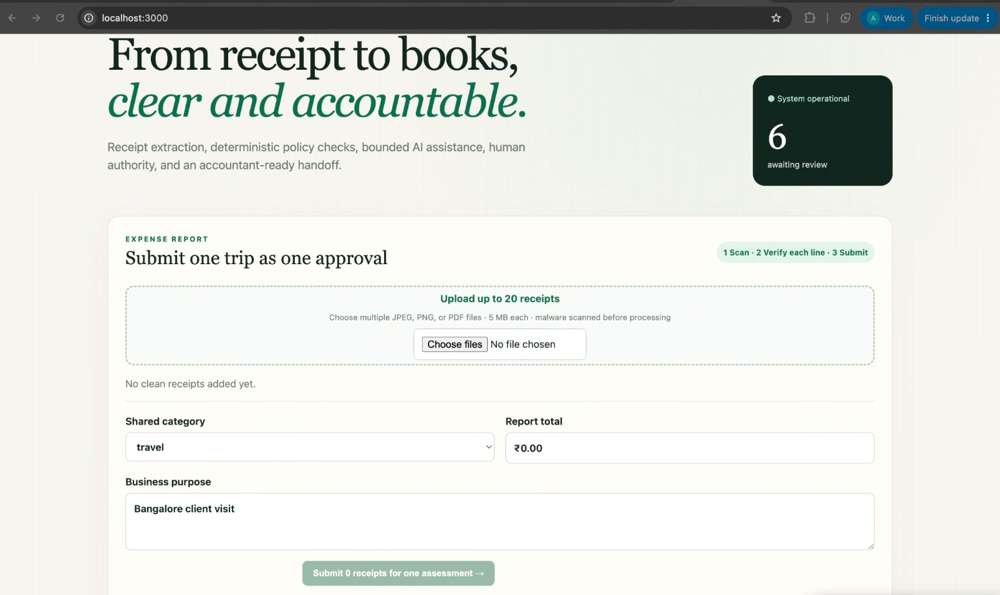
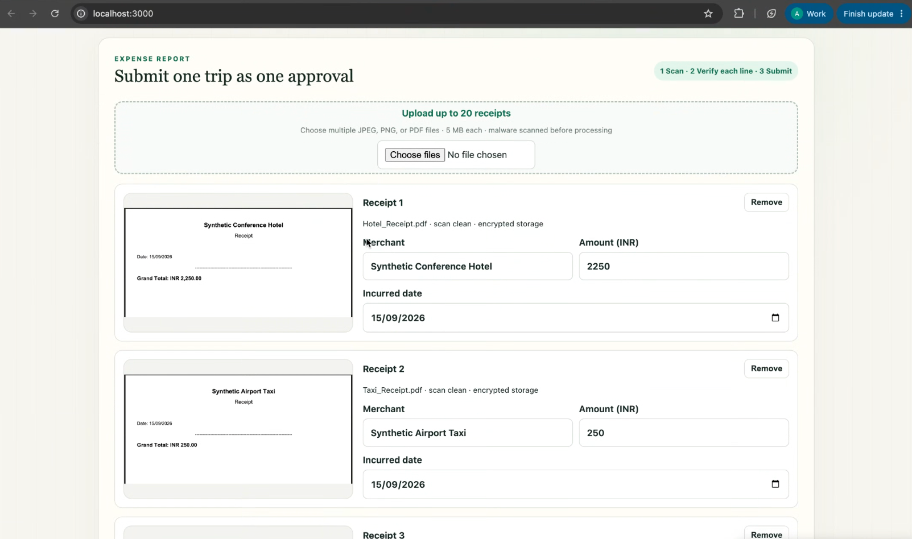
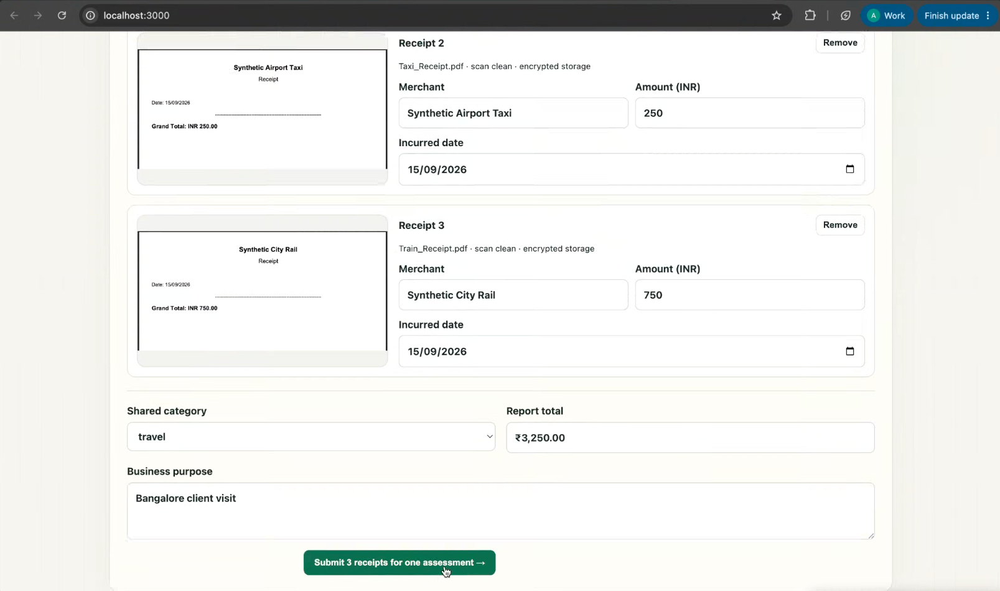
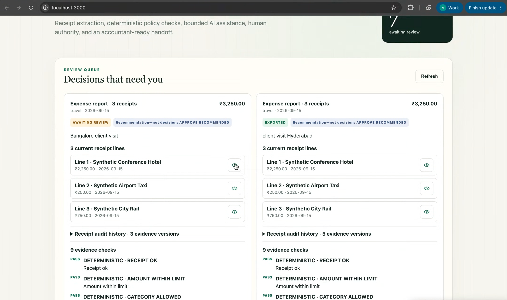
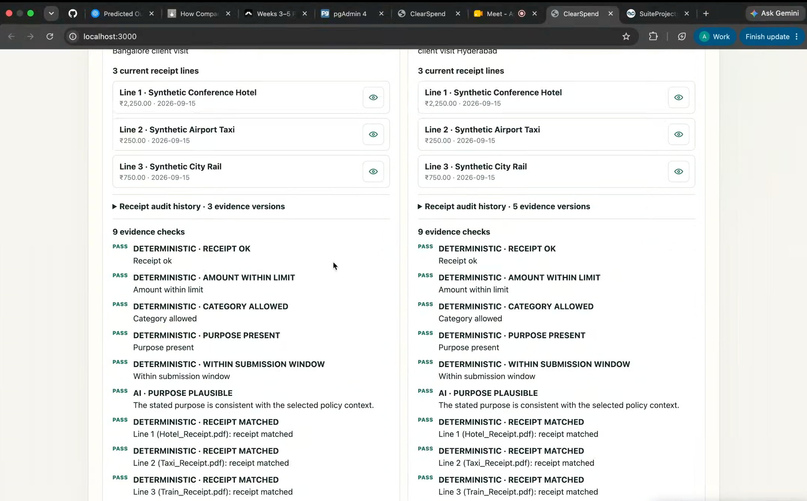
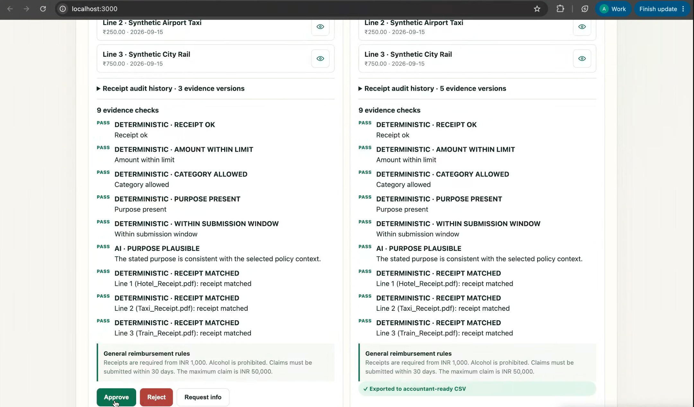
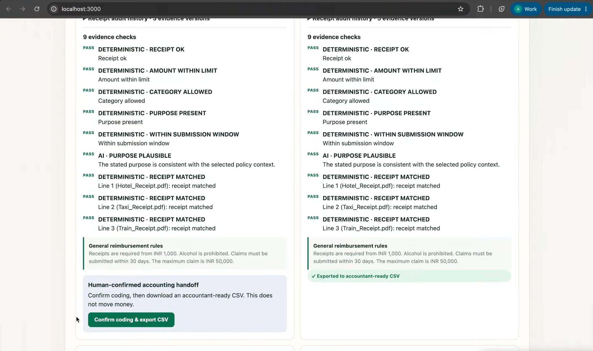
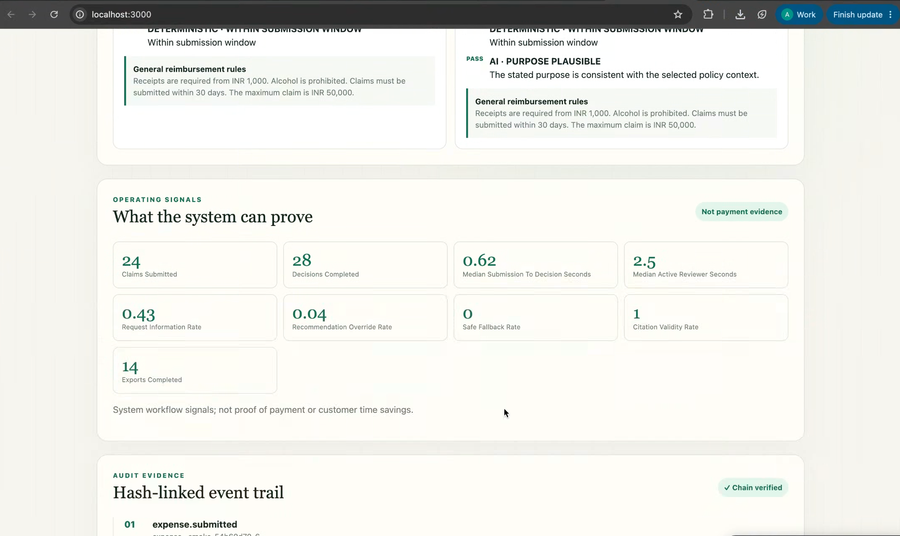

# ClearSpend

ClearSpend is a bounded, human-in-the-loop finance-operations assistant for reimbursement review. An employee can upload up to 20 same-category receipts, verify each line, and submit them as one expense report and one approval ticket. Deterministic aggregate-policy and per-receipt checks run before optional AI assistance; a finance reviewer always owns the final decision. Approved reports move to a human-confirmed accounting-code step and a line-level accountant-ready CSV—never money movement.

## Stack

- Next.js + TypeScript frontend
- FastAPI + SQLAlchemy backend
- PostgreSQL for domain state and Procrastinate jobs
- Silo (MinIO/S3-compatible) private object storage with application-side AES-256-GCM receipt encryption
- ClamAV in an isolated service for fail-closed malware scanning
- Procrastinate worker containing a bounded LangGraph workflow
- Fake AI provider by default; optional OpenAI adapter

## Run

```bash
cp .env.example .env
make demo
```

Open <http://localhost:3000>. Demo identities are selected in the UI. API docs are at <http://localhost:8000/docs>.

To inspect PostgreSQL with pgAdmin, start the optional tools profile:

```bash
make db-ui
```

Open <http://localhost:5050>. Local desktop mode normally opens directly; if a sign-in screen appears, use the `PGADMIN_DEFAULT_EMAIL` and `PGADMIN_DEFAULT_PASSWORD` values from `.env`. The `ClearSpend local` server is pre-registered. On its first database connection, enter the local PostgreSQL password `clears_spend`, then browse `Databases → clears_spend → Schemas → public → Tables`.

Synthetic PDF receipts for a manual UI walkthrough are committed in [`demo/receipts`](demo/receipts/README.md). They cover a hotel, train, and taxi flow and contain no personal or client data.

The release flow is:

1. Employee selects one or many JPEG, PNG, or PDF receipts for the same category. ClearSpend encrypts each into quarantine, malware-scans before parsing, validates structure, and promotes only clean objects for preview and extraction.
2. The employee verifies merchant, date, and amount per line. The server derives the report total, oldest incurred date, and bundle hash; clients cannot assert a different aggregate.
3. The durable worker evaluates aggregate policy plus deterministic merchant/date/amount matching for every receipt, then uses bounded LangGraph assistance only for ambiguity.
4. A reviewer sees all receipt lines and pinned policy citations, then makes one decision for the report. A request for a missed receipt appends only the new evidence; explicit replacement creates a new complete bundle revision. Prior evidence remains visible to auditors.
5. Approval enters `READY_TO_EXPORT`; a reviewer confirms account coding and downloads a recorded CSV containing one accounting line per current receipt.

## Interface

Screens from a local run at <http://localhost:3000>, using the synthetic receipts in [`demo/receipts`](demo/receipts/README.md).

**Submit one trip as one approval.** The employee picks a shared category and business purpose, then uploads up to 20 JPEG, PNG, or PDF receipts.



**Verify each line.** Clean receipts appear with a preview and extracted merchant, amount, and incurred date. The employee confirms those fields; the server derives the report total.





**Review queue.** A reviewer sees each report's lines, evidence checks, and a recommendation that is not a decision. Awaiting-review and already-exported reports stay side by side.



**Evidence.** Deterministic checks cover the receipt, amount limit, category, purpose, submission window, and per-line receipt match. Bounded AI assistance is limited to purpose plausibility against the selected policy.



**One decision for the report.** The reviewer approves, rejects, or requests more information. The pinned reimbursement rules stay on the report. An exported report shows the recorded handoff instead of decision buttons.



**Accounting handoff.** After approval, a reviewer confirms coding and downloads an accountant-ready CSV. The export does not move money.



**What the system can prove.** Operating signals summarize submissions, decisions, and exports. The hash-linked event trail records each workflow event and shows whether the chain verifies.



## Verify

```bash
make test
make verify
python scripts/smoke.py
```

The implemented system is documented in [the as-built architecture](docs/architecture/as-built-architecture.md); it takes precedence over historical target-state plans. See `CONTEXT.md`, `docs/adr/`, and `docs/operations/local-runbook.md` for supporting architecture and operations. The product-team response and deferred boundaries are in [the release response](docs/product/ramp-release-response.md). Anonymized interview evidence and research-to-product recommendations are indexed in [the canonical research folder](docs/interviews/README.md). PM attribution and the responsibility split are recorded in [Diya's role evidence](ROLE_EVIDENCE_Diya_Mondal.md) and [Prashant's role evidence](ROLE_EVIDENCE_Prashant_Chouksey.md). Assignment gaps and accountable-owner actions are in [the submission-readiness audit](docs/submission-readiness-audit.md). Grading evidence is indexed in `docs/evidence/rubric-matrix.csv`; the [decision log](docs/decision-log.md) and [AI disclosure](docs/ai-collaboration-disclosure.md) include product decisions and contributor-specific disclosure.
