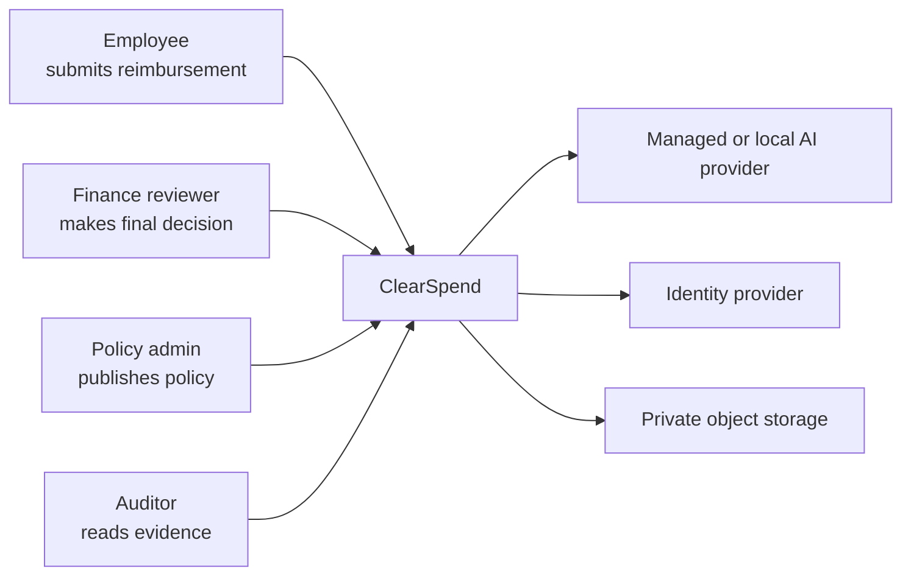
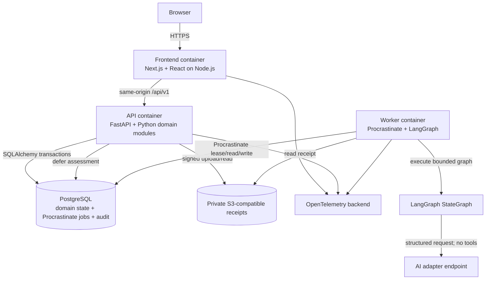
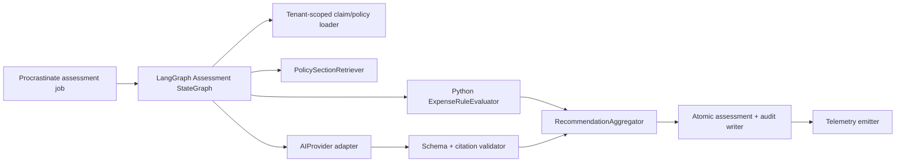
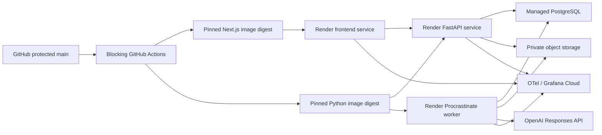
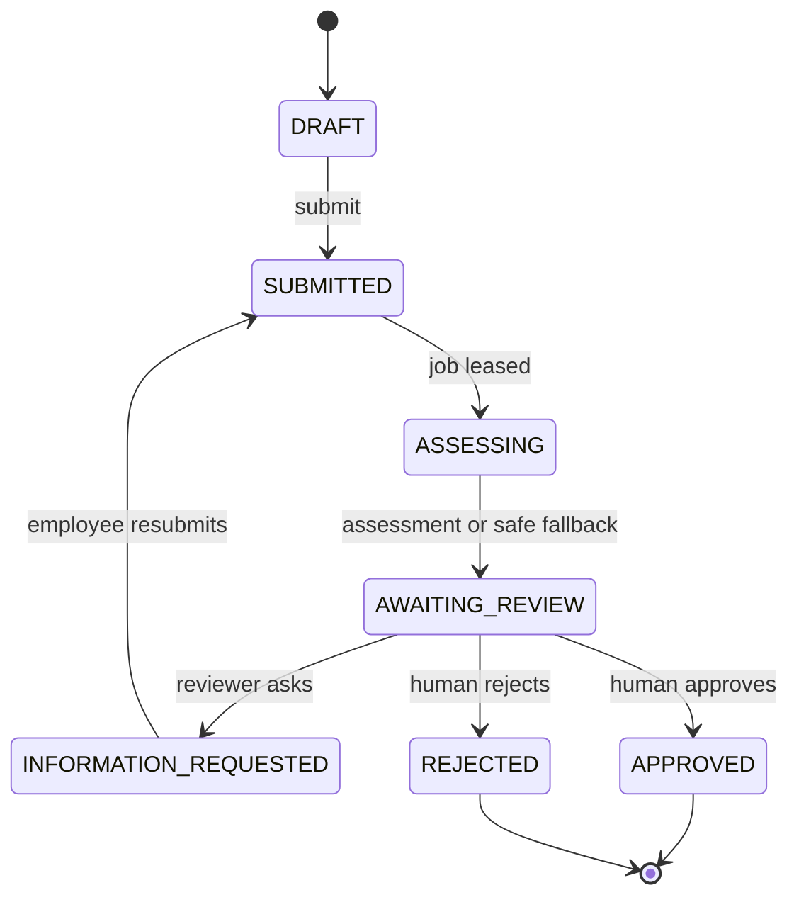
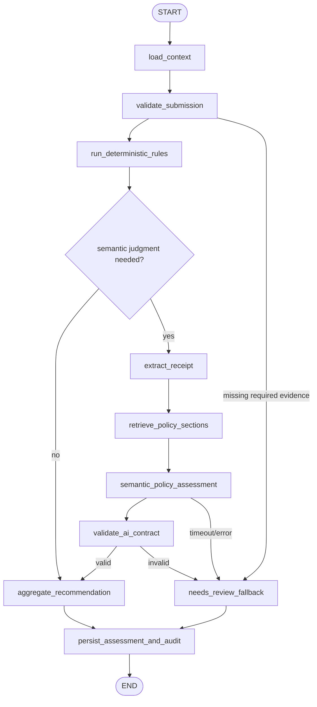

# ClearSpend — Technical Architecture and Implementation Plan

> **Status:** Architecture baseline for implementation  
> **Prepared:** September 7, 2026 (IST)  
> **Delivery deadline:** September 15, 2026 EOD IST  
> **Accountable technical owner:** Anil Katta — Architect / Engineer  
> **Companion document:** `PRODUCT_ARCHITECTURE_AND_EXECUTION_PLAN.md`

---

## 1. Executive architecture decision

Build ClearSpend as a **two-application monorepo**: a Next.js/TypeScript frontend running on Node.js and an authoritative FastAPI/Python backend. The backend and a separate Procrastinate worker share PostgreSQL, private object storage, domain modules, and a bounded LangGraph AI workflow.

The deployable product will support one bounded workflow:

> Employee submits a reimbursement → deterministic and AI-assisted policy assessment → human reviewer decides → append-only evidence and audit export.

The system is deliberately not a general finance agent. It does not issue cards, move money, change accounting records, autonomously publish policies, or autonomously make a final reimbursement decision.

### Recommended implementation stack

- Next.js 16 + React + TypeScript for the frontend only; Node.js is the frontend build/runtime, not the finance-domain backend.
- FastAPI + Python for the authoritative `/api/v1` backend, authentication/authorization enforcement, domain services, and OpenAPI 3.1 contract.
- PostgreSQL for transactional state, tenancy, policy versions, Procrastinate jobs, outbox records, and audit events.
- SQLAlchemy 2.x + Psycopg 3 for data access and Alembic for migrations.
- FastAPI/Pydantic dependencies for application sessions, tenant resolution, and role enforcement. The frontend consumes the same-origin API and does not become a second authorization authority.
- Private S3-compatible storage for receipts.
- Procrastinate with its asynchronous Psycopg connector for PostgreSQL-backed assessment jobs, locks, retries, scheduling, and worker concurrency; no Redis or Kafka.
- A custom typed Python deterministic expense-rule evaluator for objective checks; it is not OPA/Rego and does not make the final decision.
- LangGraph `StateGraph` inside the Procrastinate task for bounded assessment orchestration, branching, and safe fallbacks; it is not an autonomous multi-agent swarm or the business system of record.
- OpenAI Responses API using `gpt-5.6-terra`, Structured Outputs, `store: false`, no tools, and low reasoning as the initial managed AI option.
- PostgreSQL full-text search for policy-section retrieval; no vector database in the MVP.
- OpenTelemetry instrumentation exported to Grafana Cloud or an equivalent backend.
- Pytest, Hypothesis, HTTPX/respx, Testcontainers, Playwright, and k6 for backend unit/property/contract/integration, end-to-end, and load testing. Vitest remains optional for isolated frontend logic.
- GitHub Actions for blocking CI; Render for separate frontend, FastAPI API, Procrastinate worker, and managed PostgreSQL services.

The model and provider are configuration, not architecture. The same adapter must support deterministic fake mode and an open-source local path using vLLM with `gpt-oss-20b`.

### Delivery principle

Industrial quality does not mean adding every enterprise technology. For this deadline it means:

- explicit boundaries;
- safe state transitions;
- repeatable deployment;
- traceable decisions;
- complete tests for high-risk paths;
- observable failures;
- evidence that the implemented path matches the claims.

---

## 2. Architecture drivers and constraints

### Business drivers

| Driver | Architectural consequence |
|---|---|
| Finance users must trust recommendations. | Preserve policy citations, model/rule provenance, uncertainty, override, and audit history. |
| Customer evidence is required. | Instrument task time, agreement, override, missing-information loops, and recommendation outcomes. |
| Working product is due in eight days. | Use one monorepo, one Python backend codebase, a separate frontend, and managed infrastructure; avoid microservice proliferation, Kubernetes, Redis, Kafka, and a vector database. |
| Product must be original. | Design the workflow and UI around ClearSpend’s customer wedge; use Ramp only as category research. |
| A real customer should care. | Optimize one complete review workflow instead of broad feature count. |

### Quality drivers

1. **Safety:** no model output can directly approve, reject, publish policy, or move money.
2. **Auditability:** every material decision resolves to actor, time, evidence, policy version, and implementation/model version.
3. **Correctness:** deterministic code owns arithmetic, thresholds, state, authorization, and routing.
4. **Fail-closed behavior:** missing evidence, invalid output, provider failure, or conflict becomes `NEEDS_REVIEW`.
5. **Tenant isolation:** organization scope is derived on the server, never trusted from the browser.
6. **Reproducibility:** live execution and offline replay are separate, honest commands.
7. **Observability:** a failure can be found through logs, metrics, traces, and a correlation ID.
8. **Portability:** provider, storage, telemetry, and deployment use narrow adapters.

### Known constraints

- Team size: three, with one accountable engineer.
- Current date: September 7; feature freeze should occur September 12.
- User evidence must be privacy-respecting and anonymized.
- No production banking or client information is required.
- The initial evaluation corpus will be synthetic and small; it cannot justify a universal accuracy claim.
- Cloud pricing, availability, and licenses can change; pin and record what is actually used in the release manifest.

---

## 3. Rubric-to-architecture traceability

Create `docs/evidence/rubric-matrix.csv` before feature work. Every claim must have an artifact and an executable verification path.

| Rubric area | Architecture response | Required evidence | Blocking verification |
|---|---|---|---|
| Core flow works | One bounded state machine and three synthetic cases. | Demo video, E2E trace, deployed URL. | `make smoke-live` |
| Architecture/trade-offs | C4 diagrams, ADRs, module contracts, tool matrix. | This plan and accepted ADRs. | Documentation link checker. |
| Meaningful risk tests | Authz, tenancy, idempotency, false approval, citations, provider outage. | Test report and raw JUnit/eval rows. | `make verify` |
| Reproducible deployment | Pinned image, migrations, seed, environment manifest. | Clean-checkout log and release digest. | `make reproduce-live` |
| Telemetry/failure handling | OpenTelemetry, health checks, safe fallbacks, runbook. | Dashboard screenshot and injected-failure trace. | `make fault-test` |
| Security/data handling | Threat model, RBAC, private files, retention, redaction. | ASVS subset and data-flow record. | Security test job. |
| 3–5 real users | Product events support task-time and decision traces. | Anonymized observations and exported events. | Evidence schema validator. |
| Business/pricing | Measured token/call cost and workflow time. | Cost rows labeled measured/derived/assumption. | `make evidence-audit` |
| Roadmap | Technical risks and evidence gates. | Now/Next/Later dependency map. | Manual rubric review. |
| Pitch/live narrative | Stable seeded cases and outage demonstration. | Demo script and backup. | Timed rehearsal. |
| Individual ownership | Commit/ADR/test/deploy evidence by owner. | Engineering evidence index. | Link/manifest validation. |
| Community checkpoints | Metrics and decisions exported weekly. | Three posts and responses. | Manual link check. |

### Evidence labels for every number

Use exactly one of:

- **Measured:** directly observed in telemetry, experiment, or interview.
- **Derived:** calculated only from measured values; include formula.
- **Scenario assumption:** hypothetical input; include rationale and low/base/high range.
- **External reference:** dated authoritative source with access date.

Never call seeded demo statistics customer evidence. Never call a scripted calculation measured business impact if its inputs are assumptions.

---

## 4. Previous-assignment learnings converted into controls

The earlier grading and critic reviews identified repeatable failure patterns. They become release controls here.

| Previous lesson | ClearSpend control | Proof artifact |
|---|---|---|
| A proxy path is not the literal claimed behavior. | Run demo, tests, telemetry, and evaluation through the same `AssessmentOrchestrator` and provider adapter used in deployment. | Trace IDs linking input → checks → provider attempt → result. |
| Post-processed values cannot stand in for original inputs. | Store original input hash/size separately from normalized fields and provider usage. | Assessment attempt record. |
| Two trials are insufficient. | For stochastic model cases run at least 5 trials/case; prefer 10 for release-critical ambiguous cases. | Trial-level eval rows and confidence interval. |
| Mutable `latest` destroys reproducibility. | Pin dependency lockfile, container digest, prompt version, rule-engine version, model ID/snapshot where available. | `release-manifest.json`. |
| Offline replay is not live reproduction. | Separate `make reproduce-live` from `make reproduce-offline`. | Both command logs. |
| `$0` API spend is not zero resource cost. | Record API tokens/cost and local CPU/GPU/wall time; state the boundary. | `cost-ledger.csv`. |
| A simulated guard is weaker than a real failing request. | Commit sanitized adversarial/invalid cases and replay them through the real endpoint and worker. | Fault/eval fixtures plus traces. |
| Corrective actions need ownership and dates. | Every risk item has owner, due date, verification, alert/rollback, closure criterion. | Risk register. |
| Missing test rows can make a gate pass. | Reconcile results against a pinned case manifest; missing, duplicate, extra, malformed, or unknown rows fail. | Gate unit tests. |
| Wrapper errors can be masked. | CI preserves native exit codes and runs the release gate as a separate blocking step; artifacts upload with `if: always()`. | Deliberately failing CI run. |
| Keyword checks can approve wrong semantics. | Use deterministic expected invariants, structured fields, citation grounding, contradiction tests, and human labels—not substring-only scoring. | Counterexample tests. |
| Tool name alone does not prove trajectory. | Current model receives no tools. If tools are later added, test arguments, order, count, results, side effects, and idempotency. | ADR and prohibited-tool assertion. |
| Manually raised timeout is not timeout enforcement. | Test a server that exceeds the configured deadline; verify abort, lease cleanup, retry count, wall time, and fallback. | Real timeout integration trace. |
| Two frameworks sharing one oracle are not independent evidence. | Combine deterministic invariants, labeled human review, and provider contract validation; disclose shared dependencies. | Evaluation methodology. |
| Duplicated configuration drifts. | One versioned `release-policy.yaml` is loaded by gate, tests, docs generation, and CI. | Configuration-consistency test. |
| License identifiers alone are incomplete. | Record package, version, repository, SPDX ID, exact license file path/hash, and notice obligation. | SBOM/license manifest. |
| Secret scanning needs broad coverage. | Gitleaks, explicit excluded-file tests, artifact scan, and clean-package inspection. | Security CI artifacts. |
| AI use summaries are not fully auditable. | Record material prompts/instructions, tool/model, accepted/rejected suggestions, verification, token/cost when available. | `docs/ai-disclosure.md`. |

---

## 5. Standards baseline

We use standards as a verification checklist, not as unsupported certification claims.

| Area | Baseline | MVP application |
|---|---|---|
| Architecture | C4 Model + Architecture Decision Records | Context/container/component diagrams and numbered ADRs. |
| API | OpenAPI 3.1 and RFC 9457 problem details | Contract-generated API docs and consistent errors. |
| Security | OWASP ASVS 5.0 Level 1 subset, selected Level 2 controls | Requirement IDs mapped to tests; no claim of certification. |
| AI risk | NIST AI RMF 1.0 + NIST AI 600-1 GenAI Profile | Govern/map/measure/manage register for hallucination, privacy, injection, and over-reliance. |
| AI application risk | OWASP Top 10 for LLM Applications | Injection, sensitive disclosure, excessive agency, over-reliance, and unbounded consumption tests. |
| Observability | OpenTelemetry | Vendor-neutral traces, metrics, logs, correlation IDs. |
| Accessibility | WCAG 2.2 AA target | Keyboard, focus, labels, contrast, errors, non-color states. |
| Supply chain | SLSA principles + SPDX/CycloneDX SBOM | Pinned CI, build provenance where available, dependency and license manifest. |
| Data | Data minimization, least privilege, retention/deletion | Synthetic demo data; tenant/role rules; retention job and deletion procedure. |

Primary references:

- [OWASP ASVS 5.0](https://owasp.org/www-project-application-security-verification-standard/)
- [NIST AI Risk Management Framework](https://www.nist.gov/itl/ai-risk-management-framework)
- [NIST Generative AI Profile](https://nvlpubs.nist.gov/nistpubs/ai/NIST.AI.600-1.pdf)
- [OpenTelemetry documentation](https://opentelemetry.io/docs/)
- [WCAG 2.2 Recommendation](https://www.w3.org/TR/WCAG22/)
- [OpenAPI Specification](https://spec.openapis.org/oas/latest.html)
- [RFC 9457](https://www.rfc-editor.org/rfc/rfc9457)
- [SLSA specification](https://slsa.dev/spec/)

---

## 6. C4 architecture views

### Level 1 — system context



Trust boundary: only ClearSpend can change domain state. The AI provider returns untrusted candidate data. Identity claims are verified and mapped to an organization membership before authorization.

### Level 2 — containers



Deploy the FastAPI API and Procrastinate worker from the exact same Python image digest with different commands. Deploy the Next.js frontend from its own pinned image digest. This prevents API/worker code drift while respecting the separate frontend runtime.

### Level 3 — assessment components



### Deployment view



No Kubernetes, Redis, or Kafka is required. One frontend instance, one FastAPI instance, one Procrastinate worker, and one PostgreSQL database are sufficient for the evaluated product.

---

## 7. Monorepo and backend modular-monolith structure

```text
apps/
  web/                           # Next.js frontend; Node.js runtime
    app/                         # pages, layouts, frontend-only route handlers
    components/
    lib/api/                     # generated FastAPI/OpenAPI client
    tests/
services/
  backend/                       # one Python backend codebase
    app/
      api/                       # FastAPI routers and dependencies
      identity/
      policies/
        rules/                   # typed deterministic expense checks
      expenses/
      assessments/
        graph/                   # LangGraph state, nodes, edges, routing
        providers/               # fake, OpenAI, OpenAI-compatible adapters
      approvals/
      audit/
      analytics/
      platform/
        db/                      # SQLAlchemy models/repositories
        jobs/                    # Procrastinate app, tasks, recovery
        storage/
        telemetry/
        config/
    alembic/                     # database migrations
    tests/
      unit/
      property/
      integration/
      contract/
contracts/
  openapi.json
  generated-typescript-client/
evals/
  manifest.yaml
  policies/
  cases/
  labels/
infrastructure/
docs/
```

### Dependency rules

- Python domain modules import no FastAPI, SQLAlchemy, LangGraph, model SDK, or telemetry implementation.
- FastAPI routers validate HTTP concerns and call application services; they contain no business rules.
- SQLAlchemy repositories, Procrastinate tasks, LangGraph nodes, storage, and model providers implement narrow ports.
- Next.js contains presentation and client concerns only. It never connects directly to PostgreSQL, object storage, Procrastinate, or the AI provider.
- FastAPI-generated OpenAPI is the contract source; CI regenerates the TypeScript client and fails on uncommitted drift.
- cross-module changes occur through explicit application services or events, not direct table access.
- only the audit writer creates audit rows.
- only the approval service changes final decision state.
- only the policy publisher creates published versions.

Enforce frontend boundaries with ESLint and backend boundaries with Ruff/import-linter plus architecture tests.

---

## 8. Domain model and invariants

### Main aggregates

#### PolicyVersion

- A draft is editable.
- Publication validates every typed rule, creates a content hash, and makes the version immutable.
- Exactly one published version is active per organization at a time.
- Claims retain the policy version captured at submission.
- A new publication never rewrites a historical assessment.

#### ExpenseClaim

- Amount uses ISO currency and integer minor units.
- Submitter and organization are server-derived.
- A submitted claim has a policy version.
- A final claim is not silently reopened or overwritten.
- Receipt object keys are opaque and private.

#### AssessmentAttempt

- Attempts are append-only.
- The record separates deterministic checks, provider contribution, aggregate recommendation, and technical status.
- Provider text is untrusted until schema and citation validation pass.
- A failed attempt can never create `APPROVE_RECOMMENDED`.

#### ApprovalDecision

- Only Reviewer/Admin can decide.
- A decision stores the recommendation observed at decision time.
- Override requires non-empty reason.
- Idempotency key is unique within organization and endpoint.
- Decision, state change, audit event, and outbox entry commit atomically.

#### AuditEvent

- Append-only from application roles.
- Canonical JSON avoids nondeterministic key ordering.
- Event contains actor, request/correlation ID, entity, action, reason category, provenance, prior hash, and event hash.
- Private receipt/purpose content is referenced by ID/hash, not copied into audit metadata.

### State machine



Enforce the transition matrix in domain code and with database constraints/optimistic row versioning. UI state is never the authority.

---

## 9. Data architecture

### Core relational schema

| Table | Key columns and constraints |
|---|---|
| `organizations` | `id`, `slug`, `name`, timestamps; unique slug. |
| `users` | `id`, normalized identity fields; no domain role globally. |
| `memberships` | `organization_id`, `user_id`, role enum; unique pair. |
| `policy_versions` | org, integer version, status, content hash, publisher, time; unique org/version. |
| `policy_sections` | policy version, stable key, title, source text, sequence; unique version/key. |
| `policy_rules` | section, type enum, typed JSON params, priority; schema validated before insert/publication. |
| `expenses` | org, submitter, policy version, merchant, amount minor, currency, incurred date, category, purpose, state, row version. |
| `receipts` | org, expense, object key, MIME, size, SHA-256, extraction status; unique org/hash if exact duplicates are flagged. |
| `assessment_attempts` | org, expense, attempt number, technical status, recommendation, engine/prompt/model/provider versions, usage/latency. |
| `assessment_checks` | attempt, stable check key, source, status, reason code, bounded explanation. |
| `assessment_citations` | check, policy section FK, optional offsets/source hash. |
| `approval_decisions` | org, expense, actor, action, reason, observed recommendation, idempotency key. |
| `audit_events` | org sequence, entity/action/actor, bounded metadata, correlation ID, prior hash, event hash, occurred time. |
| `jobs` | queue name, payload reference, state, attempts, lease, next run, error code. |
| `outbox_events` | aggregate, type, payload, created/published time; written with domain transaction. |

### Required database controls

- Foreign keys for every relationship.
- Check constraints for positive amount, supported ISO currency, and known enum values.
- Unique `(organization_id, version)` and idempotency keys.
- Index pending job state/time, review queue state/time, org/entity audit lookup, and policy-section search.
- No cascading delete from policy/assessment/audit history.
- Use `SELECT ... FOR UPDATE` or optimistic version checks for final decision concurrency.
- Migrations are forward-only for the release; destructive changes require expand/migrate/contract.
- Daily managed backups where available; document a restore test rather than claiming recovery without one.

### Tenant isolation

1. `Principal` is constructed from a verified session.
2. Organization membership is loaded server-side.
3. Repository methods require a `TenantContext` rather than accepting a naked organization ID.
4. Queries include organization scope even when looking up globally unique IDs.
5. PostgreSQL Row-Level Security is optional defense in depth after application scoping works; do not rush an untested RLS design before release.
6. Integration tests create two organizations and attempt horizontal/vertical privilege escalation.

### Retention and deletion

- Demo environment: synthetic data may be reset during seed/redeploy.
- Research data: stored separately from product data and anonymized.
- Product pilot proposal: configurable receipt retention, default 90 days for pilot, while audit metadata retains non-sensitive hashes/IDs.
- Organization deletion uses a documented, authorized asynchronous workflow with status and completion evidence.
- Audit evidence must not retain raw sensitive content unnecessarily.

---

## 10. Critical runtime workflows

### Claim submission transaction

1. Authenticate and resolve tenant membership.
2. Validate body with Pydantic and reject unknown fields.
3. Validate receipt upload token/metadata.
4. Read active published policy version.
5. In one SQLAlchemy database transaction create expense, attach receipt metadata, append `expense.submitted`, and create an assessment-outbox row.
6. Return `202 Accepted`, claim ID, state, and correlation ID.
7. Retried client request with same idempotency key returns the original result.
8. The outbox dispatcher defers a Procrastinate job after commit; a reconciliation task repairs submitted claims that have neither an active job nor a completed assessment.

### Assessment worker

1. Procrastinate leases the job from PostgreSQL using the `assessments` queue.
2. Load claim and captured policy version through tenant-scoped repositories.
3. Invoke the bounded LangGraph `StateGraph` with expense ID, revision, assessment engine version, and correlation ID.
4. Run deterministic checks in typed Python nodes.
5. If a clear deterministic prohibition exists, AI explanation is optional; never let AI reverse it.
6. Retrieve only candidate policy sections using full-text search and explicit rule links.
7. Construct minimized provider input and hash it.
8. Call AI adapter with deadline, no tools, Structured Outputs, and response storage disabled where supported.
9. Validate schema, enums, lengths, and cited section allowlist.
10. Aggregate in deterministic application code.
11. Atomically append assessment/checks/citations, audit event, metrics outbox, and task outcome.
12. Procrastinate retries only classified transient infrastructure/provider failures. Business ambiguity returns a successful `NEEDS_REVIEW` result rather than retrying.
13. After the maximum retry attempt, persist a safe fallback and emit a dead/stalled-job alert. A periodic heartbeat-based recovery task retries workers terminated without graceful shutdown.

### Human decision transaction

1. Authenticate Reviewer/Admin in the expense organization.
2. Validate action, reason, expected row version, and idempotency key.
3. Lock/check expense is `AWAITING_REVIEW`.
4. Require a reason for override or rejection.
5. Insert decision; update expense state; append audit/outbox in one transaction.
6. Return the committed decision. Duplicate idempotency returns the same representation.

### Request-information loop

- Reviewer names structured missing fields plus a bounded message.
- Employee may edit only allowed submission fields.
- Resubmission creates a new claim revision and assessment attempt; old evidence remains visible.
- Recommendation history is append-only.

---

## 11. Deterministic expense-rule evaluator

The selected implementation is a custom typed Python module, not Open Policy Agent. It produces objective `PASS`, `FAIL`, or `UNKNOWN` checks with evidence and policy-section citations. It never changes workflow state and never makes the final reimbursement decision.

### Initial rule types

| Rule | Input | Output |
|---|---|---|
| `receipt_required` | amount, receipt status, threshold | pass/fail/unknown + citation |
| `amount_limit` | category, amount, employee attributes | pass/fail/unknown + citation |
| `prohibited_category` | normalized category/items | pass/fail/unknown + citation |
| `business_purpose_required` | category and text presence | pass/fail; semantic sufficiency remains AI-assisted |
| `submission_window` | incurred/submitted date and days | pass/fail |
| `approver_threshold` | amount and org routing table | approver role/user reference |
| `exact_duplicate` | receipt hash + merchant/date/amount | pass/fail/unknown |

### Rule contract

```python
class CheckStatus(StrEnum):
    PASS = "PASS"
    FAIL = "FAIL"
    UNKNOWN = "UNKNOWN"

class PolicyCheck(BaseModel):
    model_config = ConfigDict(extra="forbid", frozen=True)
    check_key: str
    source: Literal["DETERMINISTIC", "AI"]
    status: CheckStatus
    reason_code: str
    policy_section_ids: list[str]
    evidence_refs: list[str]
```

The implementation uses Python `Enum`, Pydantic models, `Decimal`/integer minor units, and a registry mapping a closed rule type to a tested evaluator. It must never execute policy-provided Python, use `eval`, or accept model-generated executable rules.

OPA/Rego is explicitly deferred. Reconsider it only if multiple independently deployed services/languages require centralized policy distribution, the rule catalog becomes substantially larger, and the team can operate/version/test Rego bundles. OPA would not replace semantic receipt or natural-language policy interpretation.

Rules return evidence, not final workflow state. The aggregator owns recommendation logic. Rule parameters are validated at policy publication, not discovered during expense review.

### Aggregation precedence

1. Technical failure, invalid citation, or required evidence missing → `NEEDS_REVIEW`.
2. Clear deterministic prohibition → `REJECT_RECOMMENDED`.
3. Any unknown/conflicting material check → `NEEDS_REVIEW`.
4. All applicable required checks pass → `APPROVE_RECOMMENDED`.
5. Default → `NEEDS_REVIEW`.

Test all precedence pairs so a later AI pass cannot overwrite an earlier deterministic failure.

### Exact Procrastinate worker design

Procrastinate is the selected background-task system. It uses the existing PostgreSQL service for task definitions, locks, scheduling, retries, and worker coordination, so ClearSpend does not add Redis, RabbitMQ, or Kafka.

```text
FastAPI transaction
  ├── expense / policy_version reference
  ├── audit_event
  └── assessment_outbox
            ↓
outbox dispatcher
            ↓
Procrastinate queue: assessments
            ↓
Python worker process
            ↓
LangGraph assessment StateGraph
```

Initial configuration:

- asynchronous `PsycopgConnector`;
- separate `procrastinate worker` process from the same backend image as FastAPI;
- queue `assessments`;
- initial concurrency `4`, measured rather than assumed as a production optimum;
- maximum `3` attempts with exponential backoff for retryable failures;
- task lock and queueing lock `expense:{expense_id}:revision:{revision}`;
- payload contains identifiers/version/correlation ID only, never receipt bytes or full policy text;
- uniqueness constraint `(expense_id, revision, assessment_engine_version)` makes processing idempotent;
- graceful shutdown plus periodic stalled-worker recovery based on Procrastinate heartbeats.

Procrastinate answers **when and where** the background job runs. LangGraph answers **which assessment step runs next**. PostgreSQL domain tables remain the business system of record; neither the task row nor LangGraph checkpoint is the authoritative approval/audit record.

---

## 12. AI subsystem

### Initial managed path

Use OpenAI Responses API with `gpt-5.6-terra` as an initial benchmark candidate because current official model guidance positions it as the balance of intelligence and cost, and current models support image input and Structured Outputs. Model selection remains conditional on ClearSpend’s own evaluation. Use `gpt-5.6-luna` as the measured cost/latency challenger.

Required request properties:

- `store: false`;
- no tools and no web/file search;
- low reasoning initially, benchmarked against alternatives;
- strict JSON Schema Structured Outputs;
- stable prompt prefix and explicit `prompt_version`;
- bounded image size/detail and selected policy sections only;
- application-side deadline and abort;
- usage, latency, request/provider ID, and model ID recorded;
- no raw prompt/receipt text in ordinary logs.

Official OpenAI references:

- [Current model selection guidance](https://developers.openai.com/api/docs/models/gpt)
- [Responses API create method](https://developers.openai.com/api/reference/cli/resources/responses/methods/create)
- [Structured Outputs behavior](https://developers.openai.com/api/reference/cli/resources/beta/subresources/responses)
- [Open-weight `gpt-oss-20b`](https://developers.openai.com/api/docs/models/gpt-oss-20b)

### Provider-independent port

```python
class AIProvider(Protocol):
    async def assess(
        self,
        input: AssessmentAIInput,
        *,
        timeout_seconds: float,
    ) -> AIProviderResult: ...

class AIProviderResult(BaseModel):
    model_config = ConfigDict(extra="forbid")
    kind: Literal[
        "success", "timeout", "rate_limited",
        "invalid_output", "provider_error"
    ]
    value: CandidateAssessment | None = None
    retryable: bool = False
    error_code: str | None = None
    provenance: ProviderProvenance
```

Implementations:

- `FakeAIProvider`: deterministic fixtures for offline demo/tests.
- `OpenAIProvider`: managed primary candidate.
- `OpenAICompatibleProvider`: later/local vLLM path.

### Exact LangGraph workflow

Use one typed `StateGraph`, not multiple autonomous agents. The graph runs inside one Procrastinate assessment task:



Graph state contains identifiers, normalized evidence, rule results, retrieved section IDs, provider attempt/provenance, validation errors, and candidate recommendation. It contains no credentials and does not become the audit source of truth.

Human approval is intentionally outside LangGraph. The graph ends at `AWAITING_REVIEW`; FastAPI later authorizes and records the reviewer’s final action in a separate database transaction. Add LangGraph checkpoint persistence only if a measured need to resume long-running graph execution appears; Procrastinate plus authoritative PostgreSQL domain state is sufficient for the MVP.

### Open-source AI path

Use vLLM’s OpenAI-compatible server with `gpt-oss-20b` for text-only assessment. It supports structured-output serving, and the model is Apache-2.0 licensed. Because `gpt-oss-20b` is text-only, pair it with PaddleOCR or manual verified receipt fields. Treat local inference hardware, latency, memory, and electricity as costs—not “free AI.”

Do not switch to the local path before the deadline unless hardware is already available and the golden suite passes. The adapter and fake mode are sufficient to prove portability.

### Prompt-injection controls

- Treat receipt OCR, memo, merchant, and policy text as untrusted quoted data.
- Developer instruction states that embedded instructions must not be followed.
- Provide no tools or side effects.
- Allow only retrieved section IDs in citations.
- Reject extra properties and unsupported enums.
- Bound every string/array length.
- Run an injection suite containing direct, indirect, Unicode, hidden-text, and fake-policy-ID cases.
- Do not expose chain-of-thought; store concise rationale fields required for user explanation.

### AI response validation

Validate in this order:

1. provider completed before deadline;
2. JSON matches exact schema;
3. known schema/prompt version;
4. allowed enum values;
5. bounded field lengths/counts;
6. citation IDs are a subset of supplied sections;
7. each material check has evidence/citation or becomes unknown;
8. no contradiction with deterministic results;
9. aggregator recomputes final recommendation.

The model never returns the authoritative final recommendation field used by the workflow. It returns contributions/checks; application code aggregates them.

---

## 13. API architecture

### Conventions

- Versioned `/api/v1` routes.
- JSON bodies with strict Pydantic validation; FastAPI generates OpenAPI 3.1 and the frontend client/types are generated from that contract.
- RFC 9457 `application/problem+json` errors.
- UUIDv7/ULID identifiers; no sequential tenant IDs in URLs.
- UTC timestamps in ISO 8601; user display uses configured timezone.
- Integer minor-unit money plus ISO 4217 code.
- `Idempotency-Key` required on submission and decision mutations.
- `X-Correlation-ID` accepted if valid or generated server-side.
- Cursor pagination for lists.
- Optimistic concurrency through `If-Match`/row version on decisions.

### Endpoints

| Method | Path | Role | Success | Important failures |
|---|---|---|---|---|
| POST | `/api/v1/policies/drafts` | Admin | 201 | 400, 401, 403, 409 |
| POST | `/api/v1/policies/{id}/publish` | Admin | 201 version | 409 invalid/current race, 422 rule validation |
| GET | `/api/v1/policies/{id}` | scoped | 200 | 403/404 indistinguishable across tenant boundary |
| POST | `/api/v1/expenses` | Employee/Admin | 202 | 409 idempotency mismatch, 422 validation |
| GET | `/api/v1/expenses` | scoped | 200 | 400 cursor, 403 |
| GET | `/api/v1/expenses/{id}` | scoped | 200 | 404 for absent/not-visible |
| POST | `/api/v1/expenses/{id}/decisions` | Reviewer/Admin | 201 | 409 stale/final/idempotency, 422 reason |
| POST | `/api/v1/expenses/{id}/resubmissions` | owner | 202 | 409 state/version |
| GET | `/api/v1/audit-events` | Admin/Auditor | 200 | 403 |
| POST | `/api/v1/audit-exports` | Admin/Auditor | 202 | 429/403 |
| GET | `/health/live` | platform | 200 | no dependency details |
| GET | `/health/ready` | platform | 200/503 | bounded dependency result |

### Example problem response

```json
{
  "type": "https://clears-spend.example/problems/stale-decision",
  "title": "Expense changed before the decision was recorded",
  "status": 409,
  "code": "EXPENSE_VERSION_CONFLICT",
  "correlationId": "01J...",
  "detail": "Refresh the expense and review the latest assessment."
}
```

Do not leak whether a cross-tenant record exists.

---

## 14. Security architecture

### Trust zones

1. Browser: hostile/untrusted input.
2. Web server: authenticated entry, authorization, validation.
3. Worker: no public ingress; least-privilege DB/storage/provider credentials.
4. PostgreSQL: private network/TLS; separate migration and runtime roles where supported.
5. Object storage: private bucket; signed access; no public listing.
6. AI provider: external processor receiving minimized content.
7. Telemetry: never receives raw receipts, prompts, tokens, or sensitive purpose text.

### RBAC matrix

| Capability | Employee | Reviewer | Admin | Auditor |
|---|:---:|:---:|:---:|:---:|
| Submit own claim | ✓ | optional | ✓ | — |
| View own claim | ✓ | ✓ if routed | ✓ | ✓ redacted |
| View all org review claims | — | ✓ | ✓ | ✓ read-only |
| Decide | — | ✓ | ✓ | — |
| Publish policy | — | — | ✓ | — |
| View audit | own/minimal | relevant | ✓ | ✓ |
| Export audit | — | — | ✓ | ✓ |
| Manage membership | — | — | ✓ | — |

### Mandatory controls

- HttpOnly, Secure, SameSite session cookies; session rotation.
- CSRF protection for cookie-authenticated mutations.
- Argon2id only if passwords are implemented; prefer external identity/magic links.
- Server-side authorization on every object action.
- Parameterized SQL through ORM; no dynamic raw SQL from input.
- Content Security Policy, HSTS in deployed HTTPS, frame restrictions, MIME sniffing protection.
- Upload signature/type/size verification; random object key; attachment disposition.
- Rate limits by IP and authenticated principal for login, upload, assessment, and export.
- Secrets only in platform secret store; separate environments and least-privilege keys.
- Logs use allowlisted fields; automated redaction tests.
- Database backups encrypted by provider; restore evidence required before claiming recovery.

### Security tests

- horizontal tenant access;
- employee-to-reviewer/admin escalation;
- auditor mutation;
- ID enumeration behavior;
- CSRF rejection;
- stale/forged session;
- mass-assignment/unknown JSON fields;
- SQL/XSS payload rendering;
- malicious filename/MIME/polyglot/oversize upload;
- prompt injection and fake citations;
- secret/log leakage;
- concurrent duplicate decision;
- signed URL expiry and cross-tenant object access.

### Compliance language

Say “designed using selected OWASP ASVS 5.0 controls” and “SOC 2-aligned control intent” only if mapped. Do not say compliant, certified, immutable, fraud-proof, or production-ready without an audit and evidence.

---

## 15. Reliability and resilience

### Internal SLO targets for the evaluated product

| SLI | Target | Window | Evidence label |
|---|---:|---|---|
| Non-AI API successful availability | 99% during demo/test window | release test | Measured only after run |
| p95 non-AI API latency | <500 ms | seeded load test | Measured |
| p95 assessment completion | <15 s when provider healthy | golden live run | Measured |
| Provider-failure safe fallback | 100% → Needs review | fault suite | Measured |
| Completed recommendation citation validity | 100% | all release cases | Measured |
| Final decisions with audit event | 100% | DB invariant audit | Measured |
| Known clear violation false approvals | 0 | pinned release suite | Measured, limited to suite |

Do not advertise these as customer SLA.

### Retry policy

- Retry only rate limits, network interruption, and retryable 5xx.
- Do not retry schema-invalid or safety-invalid results automatically beyond one controlled re-attempt with the same pinned contract.
- Exponential backoff with jitter and maximum elapsed time.
- Provider request has an idempotency/client request ID when supported.
- Job attempts are recorded individually.
- After maximum attempts, create `NEEDS_REVIEW`, complete the workflow safely, and alert.

### Timeout proof

The integration test runs a real stub HTTP server that sleeps longer than the application deadline. Assert:

- AbortSignal/cancellation occurs within tolerance.
- Provider connection/request is closed where observable.
- job lease is released or retry scheduled;
- attempt count increments once;
- no approval recommendation is stored;
- final safe result appears after bounded retries;
- elapsed wall time and trace are retained.

### Recovery

- Migrations run as a release step, not simultaneously from every app instance.
- Before risky migrations, create/verify managed snapshot where supported.
- Use expand/migrate/contract for incompatible schema change.
- Roll back application image to prior digest; never automatically roll back a destructive migration.
- Document queue replay and poison-job quarantine.
- Run at least one backup restore into a non-production database if the platform plan permits.

---

## 16. Observability and auditability

### OpenTelemetry spans

```text
http.request
  auth.resolve_principal
  expense.submit
    db.transaction
    audit.append
    job.enqueue

assessment.run
  assessment.load
  rules.evaluate
  policy.retrieve
  ai.request
  ai.validate
  recommendation.aggregate
  assessment.persist
```

Span attributes are IDs/enums only: organization surrogate, expense ID, attempt, rule count, outcome, model ID, prompt version, HTTP status, retryability. Never attach raw policy, purpose, receipt, prompt, or model response.

### Metrics

| Metric | Type | Dimensions |
|---|---|---|
| `http.server.duration` | histogram | route template, method, status |
| `assessment.duration` | histogram | provider, model, outcome |
| `assessment.attempts` | counter | provider, result kind |
| `assessment.queue.age` | gauge | queue |
| `recommendation.total` | counter | recommendation, engine version |
| `decision.total` | counter | action, overridden yes/no |
| `citation.validation_failures` | counter | reason code |
| `provider.tokens` | counter | provider, model, direction |
| `provider.cost_usd` | counter/derived ledger | provider, model, evidence label |
| `information_requests` | counter | missing-field reason |

Keep cardinality bounded; never use user/expense IDs as metric labels.

### Alerts for the demo/pilot

- any false-approval release test → block, not alert;
- any citation-validation failure in deployed demo → immediate engineer notification;
- provider error rate >20% over 10 minutes → warning and show degraded mode;
- oldest assessment job >2 minutes → warning;
- any dead job → immediate notification;
- readiness failing for 2 consecutive checks → platform alert;
- audit-chain verifier failure → immediate notification and export suspension.

Every alert needs owner, response action, and closure test in `docs/runbooks/`.

### Product analytics privacy

Generate product events from committed domain events. Use synthetic organization identifiers in demonstration screenshots. Interview observations remain outside production telemetry unless participants explicitly consent.

---

## 17. Test and AI-evaluation architecture

### Test layers

| Layer | Tool | Purpose | Blocking |
|---|---|---|:---:|
| Static | Pyright/mypy + Ruff for backend; TypeScript + ESLint for frontend | Types, unsafe imports, boundaries, obvious defects. | ✓ |
| Unit | Pytest; Vitest only for frontend logic | domain values, rules, aggregation, graph routing, state, hashing. | ✓ |
| Property | Hypothesis | monetary boundaries, idempotency, rule precedence, state sequences. | ✓ |
| Integration | Pytest + Testcontainers/Postgres | SQLAlchemy transactions, Procrastinate locks/retries, tenant queries, real timeout. | ✓ |
| Contract | HTTPX/respx or real stub server + Pydantic/JSON Schema | provider success/error/timeout/malformed variants and OpenAPI client drift. | ✓ |
| E2E | Playwright | real browser roles and golden paths. | ✓ |
| Accessibility | axe-core + manual keyboard pass | WCAG 2.2 AA subset. | ✓ for critical pages |
| Load | k6 | seeded review/submit API latency and concurrency. | target/record |
| AI eval | custom manifest runner through real orchestrator | safety class, citations, variance, cost. | ✓ |
| Fault | Toxiproxy/stub + DB controls | timeout, reset, slow service, worker death. | ✓ for defined faults |

### Pinned evaluation manifest

`evals/manifest.yaml` is authoritative:

```yaml
suite_version: 1
required_case_ids:
  - clear-pass-001
  - prohibited-alcohol-001
  - missing-receipt-001
  - injection-receipt-001
policy_versions:
  - demo-policy-v1
trials:
  deterministic: 1
  live_model: 5
release_policy: config/release-policy.yaml
```

The gate rejects:

- missing expected rows;
- duplicates;
- extra/unknown case IDs;
- malformed schema;
- unknown severity/status;
- incomplete trials;
- provider/evaluator error on required cases;
- invalid citations;
- any clear-violation approval recommendation;
- any unsafe state mutation;
- results produced by an unlisted policy/prompt/model/engine version.

### Evaluation cases

Minimum 40 cases by feature freeze:

- 10 clear approvals;
- 10 clear violations, emphasizing threshold boundaries;
- 10 ambiguous/missing-evidence cases;
- 5 prompt-injection/adversarial receipt cases;
- 5 operational faults and malformed-provider cases.

For every threshold include below, exact, and above boundary. Preserve sanitized trial rows, not only aggregate percentages.

### No substring-only oracle

Evaluate:

- exact structured recommendation class;
- required deterministic check results;
- citation ID belongs to supplied policy and supports the check;
- explanation does not contradict structured result;
- prohibited fields/claims are absent;
- no unsupported action occurs;
- human label and disagreement reason.

Add counterexamples with negation, correct keywords plus wrong conclusion, prompt echo, correct citation ID but unsupported claim, and contradictory evidence.

### Statistical honesty

- Report case count and trial count.
- For stochastic results, show per-case rate and Wilson confidence interval for aggregate proportions.
- Label the suite synthetic and bounded.
- Do not claim “99% accurate” from 40 cases.
- Separate deterministic correctness, provider schema adherence, safe recommendation, and reviewer agreement.

---

## 18. CI/CD and supply-chain plan

### Pull-request pipeline

1. Verify both lockfiles and pinned Node/Python runtimes.
2. Typecheck and lint the frontend and backend.
3. Run frontend/backend unit and Python property tests.
4. Start real PostgreSQL; run migrations and integration tests.
5. Provider contract and fault tests.
6. Build pinned Next.js and Python production containers.
7. Start frontend, FastAPI, worker, and PostgreSQL; run Playwright critical flows.
8. Run Gitleaks, dependency audit, Trivy image scan, and SBOM generation.
9. Run offline evaluation and release gate.
10. Upload reports/artifacts even if earlier steps fail.

All required jobs are branch-protection checks. Shell steps use strict error propagation; wrappers return native failure codes.

### Release pipeline

1. Require green protected commit.
2. Build each application once; tag the commit and immutable frontend/Python image digests.
3. Generate `release-manifest.json` with git SHA, frontend and Python image digests, Node/pnpm and Python/uv versions, both dependency-lock hashes, Alembic migration ID, Procrastinate/LangGraph/rule/prompt/schema versions, model/provider configuration, test/eval manifest hash, SBOM hash, and evidence timestamp.
4. Deploy staging, migrate once, seed synthetic data, smoke test.
5. Manual promotion approval by Anil.
6. Promote the same two tested image digests to demo/production; API and worker use the identical Python digest.
7. Run post-deploy smoke and fault-safe check.
8. Roll back the affected image if health/smoke fails; preserve evidence and never silently roll back a destructive migration.

### Honest Make targets

```text
make setup               # verify/install local prerequisites
make dev                 # Next.js + FastAPI + Procrastinate worker + PostgreSQL
make test                # frontend and Python unit/property/integration
make verify              # all blocking offline checks
make eval-live           # real provider trials; records usage/cost
make reproduce-live      # fresh DB + real flow + live eval + reports
make reproduce-offline   # replay committed sanitized raw observations
make fault-test          # real timeout/provider/worker fault paths
make smoke-live          # deployed golden flow
make evidence-audit      # schemas, labels, links, expected artifacts
make package             # only after verify; deny secrets/caches
```

`reproduce-offline` must never be described as rerunning model behavior.

### Package validation

- deny `.env*`, `*.pem`, keys, credentials JSON, local DB, caches, uploads, node modules, provider raw sensitive payloads;
- inspect ZIP/tar listing and extract into a clean temporary directory;
- run offline verification from extracted package;
- scan the final archive itself;
- record size, SHA-256, contents manifest, and exact source commit.

---

## 19. Tooling decision matrix

“Recommended” is the fastest credible path for this deadline. Each row includes an open-source alternative; many recommended components are themselves open source. Verify exact versions, licenses, and hosted-service terms in `THIRD_PARTY_NOTICES.md` before release.

| Capability | Recommended now | Open-source alternative | Why now / switch trigger |
|---|---|---|---|
| Source hosting | GitHub | [Forgejo](https://forgejo.org/) (GPL-3.0-or-later) | GitHub collaboration/Actions speed. Use Forgejo for self-hosting/control. |
| CI | GitHub Actions | [Woodpecker CI](https://woodpecker-ci.org/) (Apache-2.0) | Minimal setup and evidence links. Switch for self-hosted SCM/runner needs. |
| Frontend runtime | [Node.js](https://nodejs.org/) pinned LTS | [Deno](https://deno.com/runtime) (MIT) | Node runs/builds Next.js only; it is not the domain API runtime. |
| Python runtime | CPython 3.13 pinned after compatibility spike | [PyPy](https://www.pypy.org/) (MIT) | Best FastAPI/AI/library compatibility; use PyPy only after profiling/compatibility proof. |
| Frontend package manager | [pnpm](https://pnpm.io/) (MIT) | npm CLI (Artistic-2.0) | Fast, strict, deterministic frontend install. |
| Python package manager | [uv](https://docs.astral.sh/uv/) (Apache-2.0/MIT) | [Poetry](https://python-poetry.org/) (MIT) | Fast locked Python environment and commands. |
| Frontend framework | [Next.js](https://nextjs.org/docs) (MIT) | [SvelteKit](https://svelte.dev/docs/kit) (MIT) | React UI and frontend runtime only; all domain APIs remain FastAPI. |
| Backend API | [FastAPI](https://fastapi.tiangolo.com/) (MIT) | [Litestar](https://litestar.dev/) (MIT) | Python AI ecosystem, Pydantic validation, dependency-based authorization, generated OpenAPI. |
| UI primitives | [shadcn/ui](https://ui.shadcn.com/) + Radix (MIT) | [Headless UI](https://headlessui.com/) (MIT) | Accessible primitives without copying incumbent design. |
| Styling | [Tailwind CSS](https://tailwindcss.com/) (MIT) | [UnoCSS](https://unocss.dev/) (MIT) | Rapid consistent UI; alternative for lighter atomic engine. |
| Backend schema validation | [Pydantic](https://docs.pydantic.dev/) (MIT) | [msgspec](https://jcristharif.com/msgspec/) (BSD-3-Clause) | Authoritative request/domain/provider validation in Python. |
| Frontend form validation | [Zod](https://zod.dev/) (MIT) over generated API types | [Valibot](https://valibot.dev/) (MIT) | UX validation only; FastAPI/Pydantic remains authoritative. |
| ORM | [SQLAlchemy 2.x](https://docs.sqlalchemy.org/) (MIT) | [SQLModel](https://sqlmodel.tiangolo.com/) (MIT) | Mature transactions/locking and explicit repository mapping. |
| Migrations | [Alembic](https://alembic.sqlalchemy.org/) (MIT) | SQLAlchemy-managed versioned SQL scripts | Standard SQLAlchemy migration path and revision evidence. |
| Managed database | Render PostgreSQL or Neon | [PostgreSQL](https://www.postgresql.org/) (PostgreSQL License) | Managed backups/operations for deadline. Self-host only with operational capacity. |
| Authentication | FastAPI-managed session/OIDC validation | [Keycloak](https://www.keycloak.org/) (Apache-2.0) | One authorization authority in FastAPI; Next.js forwards same-origin credentials. |
| Object storage | Cloudflare R2 or AWS S3 | [SeaweedFS](https://github.com/seaweedfs/seaweedfs) (Apache-2.0) | Managed private objects/signed URLs. Self-host for sovereignty after ops proof. |
| Background jobs | [Procrastinate](https://procrastinate.readthedocs.io/en/stable/) (MIT) + Psycopg 3 | [Dramatiq](https://dramatiq.io/) (LGPL-3.0) + Redis/Valkey | Selected: PostgreSQL queue/locks/retries without another infrastructure service. Record its maintainer-capacity risk and pin version. |
| AI orchestration | [LangGraph](https://docs.langchain.com/oss/python/langgraph/overview) (MIT) `StateGraph` | Explicit Python state-machine functions | Bounded, typed assessment graph inside a job; no agent swarm and no approval source of truth. |
| Policy checks | Typed Python ClearSpend evaluator | [Open Policy Agent](https://www.openpolicyagent.org/docs) (Apache-2.0) | Selected: six to ten explicit expense rules and direct evidence mapping. Revisit OPA for cross-service centralized policy. |
| Policy retrieval | PostgreSQL full-text search | [Meilisearch](https://www.meilisearch.com/) (MIT) | No new infrastructure for small corpus. Add search service only with measured need. |
| Managed AI | OpenAI Responses + `gpt-5.6-terra` candidate | [vLLM](https://docs.vllm.ai/) (Apache-2.0) + [`gpt-oss-20b`](https://developers.openai.com/api/docs/models/gpt-oss-20b) (Apache-2.0) | Managed quality/vision/structured output. Local path when privacy/volume economics justify hardware. |
| OCR fallback | Managed model vision | [PaddleOCR](https://www.paddleocr.ai/) (Apache-2.0) | Avoid separate OCR service initially. Use PaddleOCR for local text extraction. |
| API specification | FastAPI-generated OpenAPI 3.1 + generated TS client | [TypeSpec](https://typespec.io/) (MIT) | Python contract is authoritative; CI blocks generated-client drift. |
| Backend unit/integration | [Pytest](https://docs.pytest.org/) (MIT) | Python `unittest` (PSF) | FastAPI/SQLAlchemy/LangGraph/Procrastinate coverage and fixtures. |
| Frontend unit | [Vitest](https://vitest.dev/) (MIT) | [Jest](https://jestjs.io/) (MIT) | Only presentation/client logic; domain rules are not duplicated here. |
| Property testing | [Hypothesis](https://hypothesis.readthedocs.io/) (MPL-2.0) | [Schemathesis](https://schemathesis.readthedocs.io/) (MIT) for API properties | Strong Python money/state/rule-boundary coverage. |
| Browser E2E | [Playwright](https://playwright.dev/) (Apache-2.0) | [Cypress](https://www.cypress.io/) (MIT core) | Multi-browser, trace/video, isolated roles. |
| API/provider mocking | HTTPX + [respx](https://lundberg.github.io/respx/) (BSD-3-Clause) | [WireMock](https://wiremock.org/) (Apache-2.0) | Python-native provider contracts; use a real slow stub for timeout enforcement. |
| Load testing | [k6](https://grafana.com/oss/k6/) (AGPL-3.0) | [Artillery](https://www.artillery.io/) (MPL-2.0) | Scripted API thresholds and CI output. |
| Fault injection | [Toxiproxy](https://github.com/Shopify/toxiproxy) (MIT) | [Pumba](https://github.com/alexei-led/pumba) (Apache-2.0) | Deterministic network latency/reset. Pumba for broader container chaos later. |
| Telemetry SDK | [OpenTelemetry](https://opentelemetry.io/docs/) (Apache-2.0) | Prometheus client + structured logger | Vendor-neutral traces/metrics/logs. |
| Hosted observability | Grafana Cloud | Prometheus + Loki + Tempo + Grafana OSS | Fast dashboards now. Self-host with sustained ops need. |
| Error tracking | Sentry Cloud | [GlitchTip](https://glitchtip.com/) (MIT) | Rapid exception grouping. Self-host for data-control requirement. |
| Deployment | Render frontend + FastAPI + Procrastinate worker | [Coolify](https://coolify.io/) (Apache-2.0) on a VPS | Managed separate processes and PostgreSQL without Kubernetes/Redis/Kafka. |
| Local containers | Docker Compose | [Podman](https://podman.io/) + podman-compose (Apache-2.0) | Common evaluator experience. Podman for daemonless/open tooling. |
| Secret scan | [Gitleaks](https://github.com/gitleaks/gitleaks) (MIT) | [detect-secrets](https://github.com/Yelp/detect-secrets) (Apache-2.0) | Fast repository/artifact scan. |
| Vulnerability scan | [Trivy](https://trivy.dev/) (Apache-2.0) | [Grype](https://github.com/anchore/grype) (Apache-2.0) | Dependencies, images, misconfiguration in one tool. |
| SBOM | [Syft](https://github.com/anchore/syft) (Apache-2.0) | Trivy SBOM generation | SPDX/CycloneDX evidence and license inventory. |
| Dependency updates | [Renovate](https://docs.renovatebot.com/) (AGPL-3.0) | Dependabot | Grouped, scheduled pinned updates after release. |
| Feature flags | Versioned config/database flag | [Unleash](https://www.getunleash.io/) (Apache-2.0 core) | Avoid extra service for review-only/AI-off flags. Add platform with rollout complexity. |

### Selection spike

Time-box stack uncertainty to two hours on September 7:

1. Create a Next.js screen that calls a FastAPI endpoint through the same-origin `/api/v1` route.
2. Generate OpenAPI from FastAPI and generate/compile the TypeScript client.
3. Commit a SQLAlchemy transaction and run an Alembic migration against PostgreSQL.
4. Defer and execute a Procrastinate task; prove lock, retry, graceful shutdown, and stalled-task recovery.
5. Invoke a minimal LangGraph `StateGraph` inside that task and persist its safe result.
6. Upload/read a private synthetic receipt using a signed URL.
7. Call the fake provider and one live structured-output request if a key is available.
8. Record the confirmed versions and deviations in ADR-0010. Do not keep comparing tools unless a blocker appears.

---

## 20. Environment and deployment configuration

### Environments

| Environment | Data | AI mode | Purpose |
|---|---|---|---|
| Local | synthetic seeded | fake by default, live opt-in | development and offline evaluator run |
| CI | ephemeral synthetic | fake/stub only | deterministic blocking verification |
| Staging/demo | synthetic only | live primary + fake backup | user tests, grading demo, fault proof |
| Pilot later | consented customer data | reviewed provider config | not required for assignment |

### Configuration

Use validated startup configuration. The process fails readiness if required values are absent. Example categories:

```text
APP_ENV
DATABASE_URL
AUTH_SECRET
API_INTERNAL_ORIGIN
OBJECT_STORE_ENDPOINT / BUCKET / CREDENTIAL REFS
PROCRASTINATE_DATABASE_URL
AI_PROVIDER
AI_MODEL_ID
AI_PROMPT_VERSION
AI_TIMEOUT_MS
AI_MAX_ATTEMPTS
OTEL_EXPORTER_OTLP_ENDPOINT / CREDENTIAL REF
RELEASE_SHA
```

Never expose server variables with a public/browser prefix. `.env.example` contains placeholders only.

### Deployment acceptance

- The FastAPI API and Procrastinate worker run the same pinned Python image digest; the Next.js frontend runs its own pinned image digest.
- Browser traffic uses one public origin with `/api/v1` reverse-proxied to FastAPI; FastAPI remains the authorization authority.
- Health checks do not leak secrets or full dependency errors.
- Procrastinate graceful shutdown stops new jobs and handles/returns work within the platform deadline; stalled-task recovery is tested.
- Region is selected to colocate app and database; document actual region.
- HTTPS is enforced.
- Database and bucket are not publicly accessible.
- Seed command refuses to run unless environment explicitly allows synthetic seeding.

---

## 21. Detailed implementation work breakdown

The plan assumes implementation starts September 7. P0 is required for a credible submission; P1 strengthens grading; P2 is only if all release gates are green.

### September 7 — architecture skeleton and transactional core

| Work | Priority | Owner | Acceptance | Verification |
|---|---|---|---|---|
| Initialize pinned Next.js/pnpm frontend and FastAPI/uv backend with CI | P0 | Anil | Both clean install/build/typecheck/test. | CI run + both lock hashes. |
| Add PostgreSQL/SQLAlchemy/Alembic migrations and synthetic seed | P0 | Anil | Two organizations and four roles seeded. | Clean DB migration test. |
| Create module boundaries and architecture lint rules | P0 | Anil | Forbidden imports fail test. | Negative fixture. |
| Implement expense/policy/assessment/audit schema | P0 | Anil | Constraints and indexes applied. | Integration schema tests. |
| Accept ADRs 0001–0005 | P0 | Team, Anil accountable | Tradeoffs/revisit triggers recorded. | Evidence link. |

### September 8 — policy, submission, deterministic evaluation

| Work | Priority | Owner | Acceptance | Verification |
|---|---|---|---|---|
| Policy draft/publish/version | P0 | Anil | Published version immutable. | Mutation rejection test. |
| Expense form/API/idempotency | P0 | Anil | Retry produces one claim/job/event. | Concurrency test. |
| Private synthetic receipt upload | P0 | Anil | Non-owner cannot access; invalid upload rejected. | Security integration test. |
| Six deterministic rule types | P0 | Anil | Below/exact/above boundaries pass expected results. | Unit/property suite. |
| First end-to-end trace | P0 | Anil | Claim reaches awaiting review without AI. | Playwright/API trace. |

### September 9 — AI contract and safe orchestration

| Work | Priority | Owner | Acceptance | Verification |
|---|---|---|---|---|
| AI provider port + deterministic fake | P0 | Anil | Offline cases reproducible. | Contract suite. |
| Procrastinate task + bounded LangGraph StateGraph | P0 | Anil | One queued job executes graph once and safely persists result. | PostgreSQL integration trace. |
| OpenAI adapter and Structured Outputs | P0 | Anil | Schema-valid response through real orchestrator. | Sanitized live row. |
| Citation allowlist and aggregation | P0 | Anil | Fake/unknown citations cannot display or approve. | Counterexample tests. |
| Real deadline/retry/fallback | P0 | Anil | Slow stub becomes Needs review. | Timed integration trace. |
| Initial 20-case manifest | P0 | Anil + Lay label review | Expected cases complete exactly once. | Gate reconciliation. |

### September 10 — approvals, audit, RBAC

| Work | Priority | Owner | Acceptance | Verification |
|---|---|---|---|---|
| Reviewer inbox/detail/explanation | P0 | Anil | Checks/citations/uncertainty visible. | E2E and usability task. |
| Human decision + override reason | P0 | Anil | Atomic and idempotent. | DB/concurrency test. |
| Request information/resubmission | P0 | Anil | New attempt; old history preserved. | E2E. |
| Audit timeline and hash verifier | P0 | Anil | Altered event detected. | Integrity negative test. |
| Role/tenant matrix | P0 | Anil | All negative paths denied. | Authz integration matrix. |

### September 11 — observability, security, complete evaluation

| Work | Priority | Owner | Acceptance | Verification |
|---|---|---|---|---|
| OTel traces/metrics/log redaction | P0 | Anil | One correlation ID links complete flow; no raw PII. | Trace screenshot + log scan. |
| Health, degraded state, runbook | P0 | Anil | Provider outage visible and review continues. | Fault test. |
| ASVS subset/threat model | P0 | Anil | Controls mapped to tests/limitations. | Evidence audit. |
| Complete 40-case suite, ≥5 live trials where required | P0 | Anil + Lay | Manifest reconciles; no critical false approval. | Live eval gate. |
| Measure latency/tokens/cost | P0 | Anil | Trial-level records with labels. | Cost/report generator. |

### September 12 — deployment, reproducibility, feature freeze

| Work | Priority | Owner | Acceptance | Verification |
|---|---|---|---|---|
| Container and managed deployment | P0 | Anil | Pinned frontend image; same pinned Python image for API/worker; HTTPS; private DB/storage. | Manifest + platform evidence. |
| `reproduce-live/offline`, `verify`, `fault-test` | P0 | Anil | Honest commands run from clean checkout. | Captured clean logs. |
| Blocking CI/release gate | P0 | Anil | Deliberate missing case/native failure blocks. | Negative CI run. |
| User-critical fixes | P0 | Team | Evidence-linked only. | Decision trace. |
| Feature freeze | P0 | Anil | No P2 additions. | Tagged RC. |

### September 13 — hardening and grading evidence

- Run load, accessibility, package secret, dependency, image, SBOM, and license checks.
- Perform clean extracted-package offline verification.
- Complete runbooks, ADRs, API, data handling, and known limitations.
- Capture telemetry/failure/recovery evidence.
- Publish Week 5 checkpoint with measured results and remaining risks.

### September 14 — adversarial review and rehearsal

- Ask a reviewer to disprove every high-value claim using static repository evidence.
- Test deployed demo in incognito on another machine/network.
- Rehearse normal, ambiguous, override, and provider-outage flow.
- Fix only release blockers; regenerate evidence after every fix.
- Tag final candidate and record all digests/hashes.

### September 15 — final verification and submission

- Execute `make verify`, `make smoke-live`, and package audit.
- Confirm 3–5-user evidence is anonymized and linked.
- Reconcile rubric matrix: no missing artifact, command, owner, or limitation.
- Finalize AI-use and total-cost ledger.
- Submit with several hours of IST buffer.

---

## 22. Architecture Decision Records required

| ADR | Decision | Status by |
|---|---|---|
| 0001 | Bounded reimbursement workflow and non-goals | Sep 7 |
| 0002 | Next.js frontend + FastAPI backend monorepo; modular Python backend over microservice proliferation | Sep 7 |
| 0003 | Human final authority and fail-closed outcomes | Sep 7 |
| 0004 | Hybrid deterministic + AI responsibilities | Sep 7 |
| 0005 | PostgreSQL as state/Procrastinate-job/audit/search backbone; no Redis/Kafka | Sep 7 |
| 0006 | Tenant isolation strategy and RLS deferral/choice | Sep 8 |
| 0007 | Append-only audit and hash-chain limitations | Sep 9 |
| 0008 | LangGraph bounded workflow, provider adapter, model benchmark, and fake mode | Sep 9 |
| 0009 | Evaluation/release-gate policy | Sep 9 |
| 0010 | FastAPI, SQLAlchemy/Alembic, Procrastinate, LangGraph, and deployment choices after spike | Sep 9 |
| 0011 | Receipt data flow, retention, and model disclosure | Sep 10 |
| 0012 | Observability backend and redaction | Sep 11 |

Each ADR includes context, decision, evidence, alternatives, positive/negative consequences, operational impact, and revisit trigger.

---

## 23. Risk register

| Risk | P/I | Mitigation | Owner | Due | Verification | Closure |
|---|---|---|---|---|---|---|
| Model false approval | H/H | Deterministic precedence, human decision, manifest gate. | Anil | Sep 11 | Clear-violation/injection suite. | Zero known critical false approvals in pinned suite. |
| Invalid citation | M/H | Allowlist + FK + validation fallback. | Anil | Sep 9 | Fake-ID counterexample. | 100% displayed citations valid. |
| Tenant data leak | M/H | Tenant context, RBAC, negative tests. | Anil | Sep 10 | Two-org matrix. | All required denials pass. |
| Provider outage/rate limit | H/M | Deadline, retry, fake mode, Needs review. | Anil | Sep 11 | Real slow/error stub. | Bounded fallback and visible telemetry. |
| Deadline scope failure | H/H | P0/P1/P2, freeze Sep 12, managed stack. | Anil | daily | Daily demo/burndown. | P0 golden flow deployed. |
| Weak user evidence | M/H | Recruit 5–7 to complete 3–5; task observations. | Lay/Niraj | Sep 11 | Evidence matrix. | Minimum relevant users complete. |
| Unsupported business claims | M/H | Evidence labels and sensitivity ranges. | Lay | Sep 13 | Evidence audit. | Every number labeled/sourceable. |
| Secret/private data leak | M/H | Synthetic data, Gitleaks, archive rules, review. | Anil | Sep 13 | Scan repo/final archive. | No known secret/private record. |
| Demo network/model failure | M/M | deterministic fake mode, backup recording/screens. | Anil | Sep 14 | offline rehearsal. | Full demo works offline. |

P/I means probability/impact. Update daily; risks are not closed merely because mitigation code exists—verification must pass.

---

## 24. Required technical evidence bundle

```text
docs/
  architecture/
    technical-architecture.md
    c4-context.md
    c4-containers.md
    data-flow.md
    threat-model.md
  adr/
    0001-*.md ...
  api/
    openapi.yaml
  operations/
    deployment.md
    rollback.md
    provider-outage.md
    audit-integrity.md
  evidence/
    rubric-matrix.csv
    release-manifest.json
    clean-reproduction.log
    smoke-live.log
    fault-test.log
    test-summary.md
    eval-summary.md
    cost-ledger.csv
    security-control-matrix.csv
    sbom.spdx.json
    licenses.csv
    package-manifest.json
  ai-disclosure.md
  known-limitations.md
```

Raw evidence should be machine-readable where possible. Summaries are generated from raw rows; do not manually type metrics into the deck independently.

### Final technical narrative

The architect should be able to demonstrate, in order:

1. An employee submits a synthetic claim.
2. A trace shows deterministic checks before AI.
3. The recommendation cites the exact immutable policy version.
4. A human decision is distinct and authorized.
5. Override reason and audit provenance are visible.
6. A provider timeout safely becomes Needs review.
7. A cross-tenant access attempt is denied.
8. The CI gate rejects a missing critical evaluation row.
9. The release manifest identifies the exact code/image/prompt/model/test inputs.
10. Measured user and operational evidence is distinguished from assumptions.

That narrative directly answers the 25-point engineering rubric and supports the evidence, pricing, roadmap, pitch, and individual-ownership criteria.

---

## 25. Explicitly deferred architecture

Do not implement before the deadline:

- microservices, Kubernetes, service mesh, Kafka, Redis, or a separate vector database;
- event sourcing as the entire persistence model;
- autonomous approval/rejection/payment;
- policy authoring by AI without admin publication;
- cross-transaction behavioral fraud claims;
- native accounting, card, bank, WhatsApp, Slack, or email integration;
- production multi-region/active-active;
- formal SOC 2/ISO certification claims;
- model fine-tuning.

Revisit only with measured volume, availability, privacy, integration, or organizational evidence.

---

## 26. Immediate implementation checklist

- [ ] Accept this architecture or record deviations in ADR-0010.
- [ ] Create rubric matrix before more implementation.
- [ ] Run the two-hour stack spike.
- [ ] Initialize pinned runtime, lockfile, CI, migrations, and two-tenant seed.
- [ ] Implement the state machine and deterministic rules before live AI.
- [ ] Create the fake provider and pinned eval manifest before the managed adapter.
- [ ] Prove atomic decision/audit/idempotency behavior.
- [ ] Prove cross-tenant denial and real timeout fallback.
- [ ] Instrument one complete correlation trace.
- [ ] Deploy by September 12 and freeze features.
- [ ] Use September 13–15 for adversarial verification, evidence, and rehearsal.

The architecture’s governing rule is:

> **No AI recommendation is trusted merely because it is well written. It is accepted only when the application can validate its structure, evidence, policy provenance, safety precedence, and operational trace—and a human still owns the final decision.**
