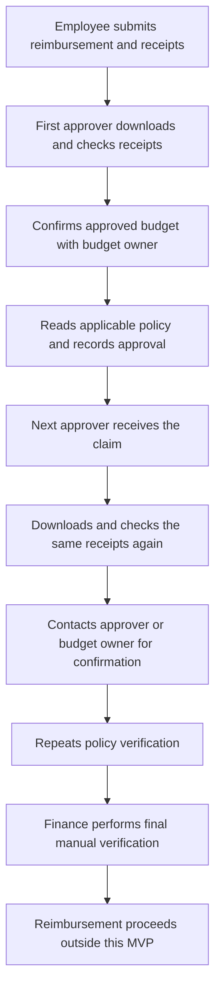
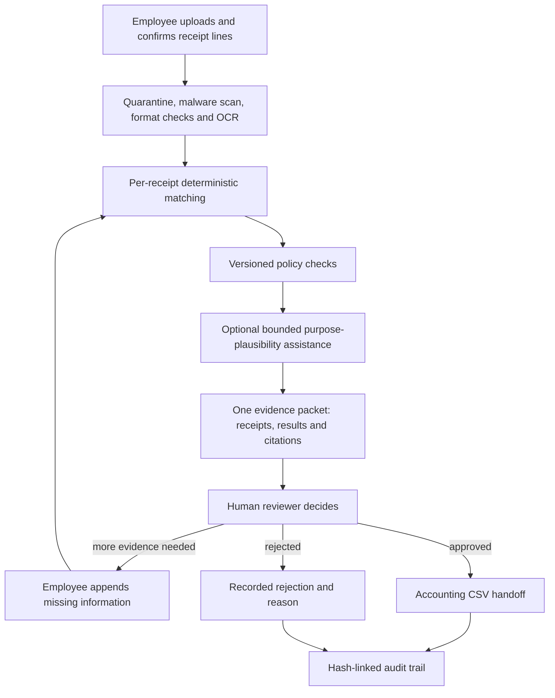

# Employer finance flow — before and with ClearSpend

- **Source:** organizational process described by Anil Katta
- **Evidence type:** experience narrative, not a system-generated process-mining result
- **Privacy:** organization and participants are anonymized

## Earlier reimbursement flow

The repeated checks arose because receipts, budget confirmation, policy text and earlier decisions were not available as one trustworthy evidence packet. Each person protected their part of the process by repeating verification. This was understandable, but inefficient.

Reported pain points included:

- repeatedly downloading and opening the same receipts;
- manually matching merchant, date and amount;
- contacting budget owners or earlier approvers for context;
- independently locating and interpreting policy rules;
- waiting while the same evidence moved through several inboxes;
- fragmented explanations across email, chat and documents;
- difficulty reconstructing who checked what during an audit;
- restarting or resending information when a receipt was missing.

## ClearSpend-assisted flow

ClearSpend automates the preparation and repeatable verification work:

1. The employee uploads receipt evidence once and confirms the extracted fields.
2. Files are isolated and scanned before processing.
3. Merchant, date, amount and currency are evaluated for every receipt line.
4. The report is evaluated against an immutable policy version.
5. The reviewer sees receipt previews, policy citations, check results and the recommendation together.
6. The reviewer remains accountable for the decision.
7. A request for information continues the same case and preserves earlier evidence.
8. Approval produces a recorded accounting CSV handoff; it does not claim payment or ERP acceptance.
9. Audit history records the evidence versions, recommendation and human action.

## Expected operational effect

The intended improvement is not to remove every approver. It is to prevent each approver from rebuilding the same basic evidence analysis. Where organizational policy still requires multiple approval authorities, they should consume the same verified packet and add role-specific decisions rather than independently repeating receipt and policy checks.

The current MVP implements a single final reviewer decision. Configurable sequential or parallel approval stages, budget-owner integration and reimbursement/payment execution remain future capabilities that require organizational validation.

## Control ownership

| Control | ClearSpend | Human/organization |
|---|---|---|
| File safety and quarantine | Automated | Security operations owns incident response |
| Receipt field comparison | Deterministic assistance | Employee confirms claims; reviewer resolves ambiguity |
| Policy threshold/prohibition checks | Automated against pinned rules | Policy owner publishes and changes policy |
| Purpose plausibility | Optional AI assistance | Reviewer remains accountable |
| Final approval/rejection | Not automated | Authorized reviewer |
| Budget authorization | Evidence can be referenced | Budget owner/source system remains authoritative |
| Accounting export | Generates recorded CSV | Accountant validates/imports it |
| Payment/reimbursement | Out of scope | Existing finance/payment system |
