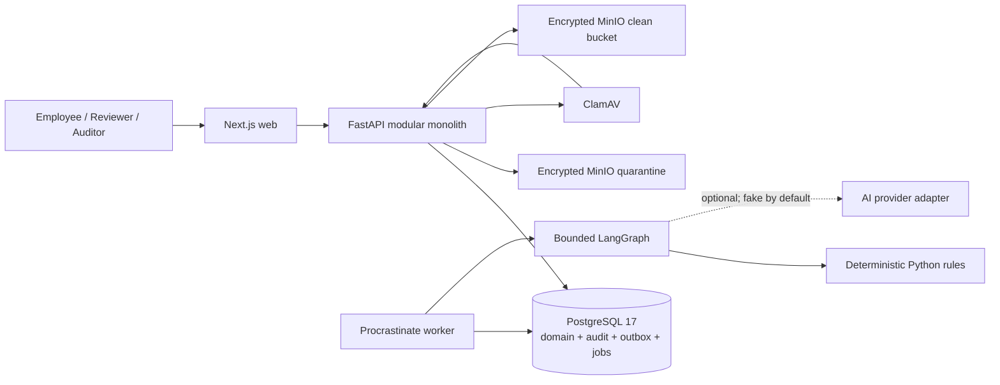
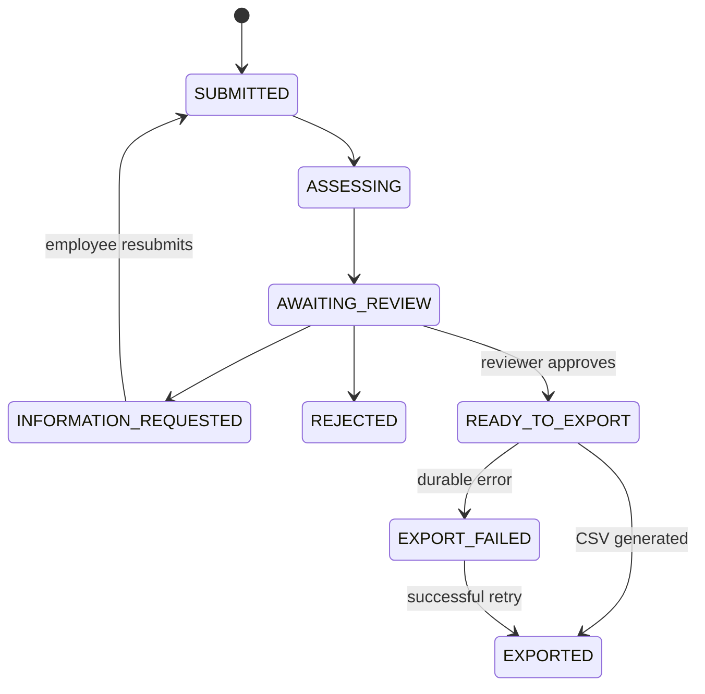
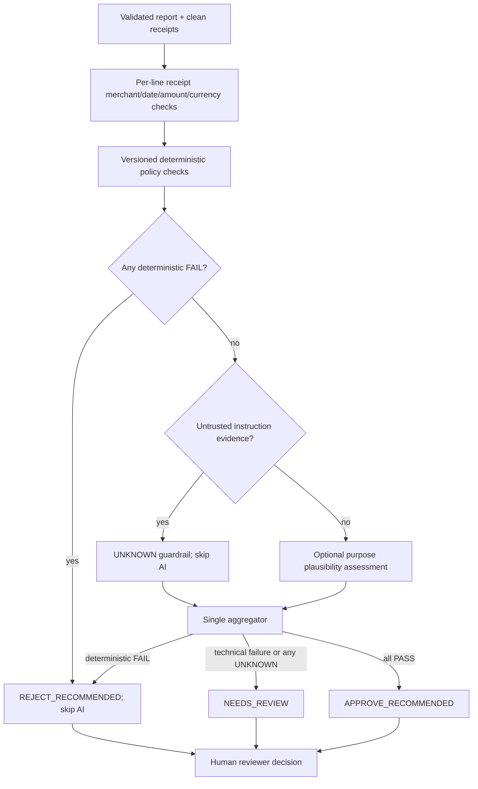

# ClearSpend as-built technical architecture

**Status:** implemented MVP, audited 2026-09-21  
**Boundary:** receipt-first employee reimbursement review. ClearSpend recommends; a human reviewer decides. It does not issue cards, move money, reimburse an employee, or confirm an ERP posting.

This is the source of truth for implemented architecture. Historical root plans contain target-state options; where they differ, this document and automated tests take precedence.

## 1. Safety and quality invariants

| Attribute | Implemented invariant |
|---|---|
| Human control | AI cannot approve, reject, export, or move money. The reviewer owns the final decision and records override reasons. |
| Fail safety | Missing/ambiguous evidence, an AI outage, or blocked AI input returns `NEEDS_REVIEW`; a deterministic hard failure returns `REJECT_RECOMMENDED`. |
| Evidence integrity | Each assessment stores checks, policy citations, receipt-version IDs, and content hashes. |
| Isolation | The server resolves organization/role from membership; domain queries are tenant-scoped and employee data is owner-scoped. |
| Durability | Domain changes and outbox events commit in PostgreSQL. The relay recovers unpublished work; assessment is revision-idempotent. |
| Document isolation | Bytes enter encrypted quarantine, are scanned before parsing, and are promoted only when clean. |
| Auditability | Material actions append tenant-scoped, hash-linked events with actor, time, correlation ID, and safe metadata. |
| Reproducibility | Compose starts the full stack; migrations, seed data, lockfiles, CI, and a smoke journey are included. |

## 2. Runtime architecture



The API is a modular monolith. PostgreSQL is the consistency boundary. Procrastinate is the PostgreSQL-backed worker; Redis and Kafka are intentionally absent. MinIO is private object storage. ClamAV has no database credentials.

## 3. Technology choices and alternatives

| Concern | Implemented | Open-source/portable alternative and selection trigger |
|---|---|---|
| Web | Next.js + TypeScript | React/Vite if server rendering is unnecessary |
| API | FastAPI + SQLAlchemy | Django/DRF if admin/content conventions dominate |
| System of record | PostgreSQL | CockroachDB only when multi-region writes justify added complexity |
| Durable work | Procrastinate on PostgreSQL | Celery/RabbitMQ for high-throughput messaging; Temporal for long-lived sagas |
| Workflow | LangGraph state graph | Plain Python state machine if the graph remains this small |
| Policy engine | Typed Python evaluators + versioned policy rows | OPA when non-developers/cross-service policy distribution requires Rego |
| Object storage | MinIO + application AES-256-GCM | S3 + KMS envelope encryption for customer-data production |
| Malware scan | ClamAV | Managed sandbox/file-scanning service for richer formats |
| OCR | pypdf + Tesseract | Document AI/Textract after measured accuracy/cost comparison |
| AI | Provider interface; deterministic fake by default | Local structured-output model through vLLM after evaluation |
| CI | GitHub Actions | GitLab CI |

The deterministic policy evaluator, not LangGraph or an LLM, decides objective rule outcomes. LangGraph only orders bounded steps and safe fallbacks.

## 4. Domain and lifecycle

Core records are `Organization`, `User`, `Membership`, immutable policy versions/sections/rules, `Receipt`, `Expense`, `ExpenseReceipt`, `AssessmentAttempt`, `ApprovalDecision`, `AccountingExport`, `OutboxEvent`, and `AuditEvent`.



`row_version` provides optimistic concurrency. Submission/decision idempotency keys bind to actor and request hash. Each resubmission increments `revision`; assessment is unique for `(expense, revision, engine_version)`.

An expense report accepts 1–20 receipt line items. Each line stores the employee-claimed merchant/date/amount/currency and is matched separately to its receipt. The report stores the computed aggregate amount and preserves ordered current items. Information-request resubmission supports append or replacement, creates immutable version links, and retains prior evidence for audit.

## 5. Assessment order and precedence



Receipt checks and receipt-security evidence enter the graph before optional AI. OCR text is untrusted evidence and is never placed into model instructions. Model input is limited to aggregate merchant/category/purpose and supplied policy-section identifiers. Output is schema-validated and cannot create authoritative citations. The default fake provider keeps the demo deterministic and offline; a live provider is an opt-in experiment, not a validated production claim.

## 6. Receipt security and storage

1. Upload size is capped; only JPEG, PNG, and PDF are allowlisted.
2. Magic bytes and deep checks reject type confusion, malformed/multi-frame images, and active, encrypted, or embedded PDF content.
3. AES-256-GCM encrypts the object before a tenant/object-scoped key is written to quarantine.
4. ClamAV scans raw bytes fail closed before parsing. Failure leaves the object quarantined and unusable.
5. Only clean content is encrypted into the clean bucket and becomes eligible for OCR and preview.
6. Bounded OCR output is checked for instruction-like patterns; flags require review and block optional AI.
7. Authorized preview decrypts through the API and records `receipt.viewed`; non-clean objects cannot be downloaded.
8. Receipt revisions retain prior links, hashes, actor, and time.

Production gates: OIDC/MFA, managed KMS/envelope keys/rotation, automated retention and deletion, scanner-signature monitoring, sandboxing for richer formats, and tested incident procedures.

## 7. Authorization model

Local demo identity uses `X-Demo-User`, which the server resolves to a stored membership; the client cannot assert a role or tenant. Production mode rejects demo authentication.

- Employee: own uploads, reports, and resubmissions.
- Reviewer: tenant review queue, decisions, and accounting-file handoff.
- Auditor: tenant-wide read-only report/evidence/audit visibility.
- Admin: policy administration and selected demo operations.

Application-level tenant predicates and cross-tenant negative tests are implemented. PostgreSQL RLS is a production defense-in-depth gate, not an implemented claim.

## 8. Reliability and failure handling

- Submission and its outbox record commit atomically.
- Direct enqueue is best-effort for latency; the relay locks/retries unpublished events.
- Procrastinate persists jobs in PostgreSQL and assessment is safe to retry per revision.
- Reviewer decisions use idempotency plus optimistic concurrency.
- CSV generation errors persist `EXPORT_FAILED`, safe code/detail, audit event, and retry path.
- AI timeout/provider/schema failure becomes `NEEDS_REVIEW` and never blocks human review.
- Readiness checks required dependencies; liveness checks only the process.

## 9. Observability and verification

Implemented observability: structured logs, correlation IDs across requests/jobs/audit, liveness/readiness, audit-chain verification, and product metrics. OpenTelemetry, Prometheus/Grafana, hosted alerts, and an external SLO dashboard are **not implemented**.

Verification includes Ruff, mypy, Pytest unit/property/evaluation tests, PostgreSQL-backed tenancy/idempotency/export/audit/outbox tests, frontend Vitest/ESLint/TypeScript, Compose validation, image builds, and a live API/worker smoke journey in CI. Known gap: there is no browser-driven Playwright suite and component coverage is minimal.

## 10. Deployment boundary

The rubric-permitted delivery is one-command local:

```bash
cp .env.example .env
make demo
```

Migrations and seed data run before readiness. `make verify` performs local static/test checks and `make smoke` verifies a running stack. GitHub Actions verifies backend/PostgreSQL, frontend production build, and the full container journey.

There is no hosted customer environment. TLS/ingress, production identity, secret manager/KMS, backups/restore test, managed data services, alert routing, and rollback rehearsal are required before customer data.

## 11. Claims boundary

Do not claim bank connectivity, actual reimbursement, ERP acceptance, autonomous finance decisions, validated live-model accuracy, or customer-data production readiness. See [`docs/known-limitations.md`](../known-limitations.md), [`docs/security/threat-model.md`](../security/threat-model.md), and [`docs/adr/`](../adr/).

